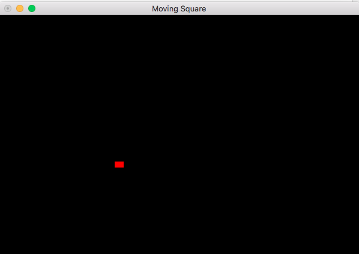

# MainCharacter

Task 2.Inclusion and animation of the main character

- The main character can be simply represented as a square or a circle. 
- Its objective is to eat all the food elements in the map. 
- The  main  character  moves  from  the  center  of  a  square  to  the  center  of  a  contiguous one. Movements are indicated through the keyboard. 
- Its movement has to be smooth and implemented using variable frame rate. 
- You can decide which its starting point in the map is.

